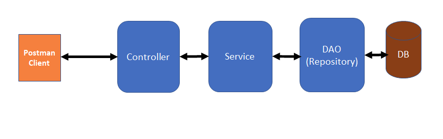
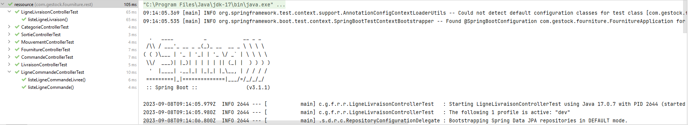

## Gestion du stock des fournitures de bureaux - Projet SpringBoot

Application Web Spring Boot pour fournir une API REST en JSON

### Récuperation du projet

```
git clone https://github.com/ahjoel/fournitures.git
```

### Connexion à une base de données

- Soit MySql ou PostgreSql créer un fichier application-dev.properties à la racine du projet pour ajouter vos données de configuration de la base de données
- Ajouter les lignes pour la documentation des APIs avec Swagger:

```
stock.openapi.dev-url=http://localhost:8080
stock.openapi.prod-url=http://localhost:8080
```

### Lancement de l'application 

- Installer JDK 17, Maven 3

- Dans le terminal, pour executer l'application avec ses tests lancer la commande
```
mvn clean install spring-boot:run
```

- Ou soit avec votre IDE Intellij IDEA, lancer l'application avec le JDK 17


### Lancement de la navigateur

- Dans le navigateur en local, pour voir les APIs de l'application aller à la page : http://localhost:8080/swagger-ui.html
- Documentation des APIs de l'application en ligne avec Swagger : https://stockfournituresbureaux.onrender.com/swagger-ui.html
- Vous pouvez également utiliser POSTMAN pour le test des APIs

### Structure de l'application

- Architecture microservice


- Design Pattern : DTO
- Integration de test unitaire


